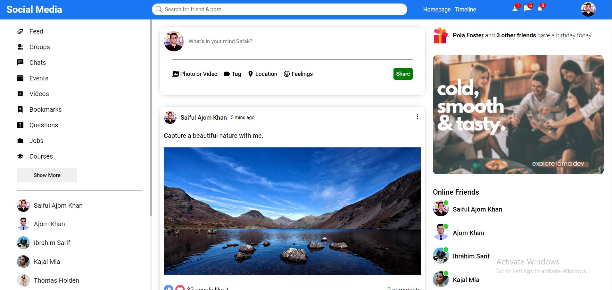

# A awesome Social Media App with React

### Go to Live Project: https://social-media-app1-react.netlify.app/

#### Add image with link in Readme Directory:

#### I highly recoment you to use Tailwinedcss or Bootstrap with Reactjs or Nextjs as a professional.

#### I haven't use any style framework (Tailwinedcss or Bootstrap) here due to css practic purpose.

### What I use here:
* React
* React-icons

#### Create React App by using command line:

    npx create-react-app ./
 
 ### Install & import React-Icon:
    npm i react-icons --save
    import { FaBars, FaTimes, } from 'react-icons/fa'
 
